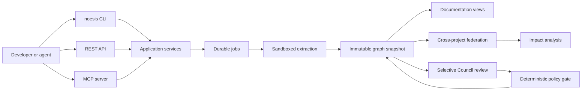

# CodeNoesis Software Architecture

> Status: **planned architecture, not an implementation description**. At the time of writing, the repository contains no working CodeNoesis crates, binaries, API, migrations, or deployments.

This document is the implementation baseline for the [CodeNoesis software track](README.md). Research-only ideas must first define an experiment and acceptance evidence in the [research track](../research/README.md); they enter this architecture only through an explicit engineering decision.

## System context

CodeNoesis will turn repository revisions and related contracts into immutable, evidence-backed knowledge snapshots. Documentation, federation indexes, and impact reports are materialized views over the canonical graph rather than independent sources of truth.



## Architectural style and dependency rules

The planned codebase is a Cargo workspace organized as a hexagonal modular monolith. Crates enforce boundaries; deployable binaries compose them.

```text
codenoesis/
├── crates/
│   ├── core/
│   │   ├── codenoesis-domain
│   │   ├── codenoesis-contracts
│   │   ├── codenoesis-ports
│   │   ├── codenoesis-application
│   │   └── codenoesis-policy
│   ├── ingest/
│   │   ├── codenoesis-repository
│   │   ├── codenoesis-extractor-core
│   │   ├── codenoesis-tree-sitter
│   │   ├── codenoesis-lang-c-family
│   │   ├── codenoesis-lang-java
│   │   ├── codenoesis-lang-rust
│   │   ├── codenoesis-lang-js
│   │   ├── codenoesis-contract-extractors
│   │   ├── codenoesis-scip
│   │   └── codenoesis-plugin-host
│   ├── knowledge/
│   │   ├── codenoesis-ontology
│   │   ├── codenoesis-graph
│   │   ├── codenoesis-federation
│   │   ├── codenoesis-impact
│   │   ├── codenoesis-docs
│   │   ├── codenoesis-query
│   │   └── codenoesis-council
│   ├── adapters/
│   │   ├── codenoesis-store-sqlite
│   │   ├── codenoesis-store-postgres
│   │   ├── codenoesis-artifact-fs
│   │   ├── codenoesis-artifact-s3
│   │   ├── codenoesis-llm
│   │   ├── codenoesis-auth
│   │   └── codenoesis-telemetry
│   └── interfaces/
│       ├── codenoesis-cli
│       ├── codenoesis-http
│       └── codenoesis-mcp
├── bins/
│   ├── noesis
│   ├── codenoesisd
│   ├── codenoesis-worker
│   ├── codenoesis-sandbox
│   └── codenoesis-migrator
└── wit/extractor.wit
```

Dependency constraints:

- `codenoesis-domain` contains entities, value objects, invariants, and domain errors. It must not depend on Tokio, SQLx, Axum, MCP, filesystem APIs, or an LLM SDK.
- `codenoesis-contracts` owns versioned serializable wire and artifact types.
- `codenoesis-ports` owns traits for repositories, stores, jobs, clocks, policy, models, and artifact publication.
- `codenoesis-application` implements use cases and transaction boundaries. CLI, HTTP, and MCP handlers contain no business logic.
- Ingest and knowledge crates depend inward on core contracts and ports; adapters implement ports; binaries perform composition.
- Rust `unsafe` is forbidden in first-party crates by default. Any unavoidable FFI is isolated in a reviewed boundary crate.
- Libraries use typed errors; human-oriented aggregation is limited to binary entry points.
- Tokio handles bounded asynchronous I/O. CPU-heavy parsing is dispatched to bounded worker pools so it cannot starve the runtime.

The initial toolchain target is stable Rust 1.97.x, edition 2024, Cargo resolver 3, with the exact patch version and `Cargo.lock` pinned at workspace bootstrap. Toolchain updates require CI validation against the [official release notes](https://doc.rust-lang.org/stable/releases.html).

## Canonical knowledge model

The canonical representation is a typed property graph scoped to an immutable repository snapshot. Generated prose, RDF, embeddings, and search indexes are reconstructable projections.

### Core entities

- Workspace, project, repository, revision, and snapshot.
- Module, package, namespace, file, symbol, type, and function.
- Service, endpoint, event, data model, configuration key, dependency, and deployment unit.
- Document, claim, evidence, and review decision.

### Core relationships

- Structural: `CONTAINS`, `DEFINES`, `IMPORTS`, `IMPLEMENTS`.
- Behavioral: `CALLS`, `READS`, `WRITES`, `PRODUCES`, `CONSUMES`.
- Architectural: `DEPENDS_ON`, `EXPOSES`, `CLIENT_OF`, `CONFIGURED_BY`, `DEPLOYS`.
- Epistemic: `DERIVED_FROM`, `SUPPORTED_BY`, `CONTRADICTED_BY`, `REVIEWED_BY`.
- Federation and impact: `SAME_AS`, `AFFECTS`.

### Claim states

- `deterministic_fact`: produced by a parser, compiler index, or authoritative contract;
- `derived_fact`: produced by a versioned deterministic Rust rule;
- `candidate`: heuristic or model proposal awaiting a gate;
- `reviewed_inference`: accepted by the Council policy but still distinct from a deterministic fact;
- `confirmed`: confirmed by deterministic evidence or an authorized human;
- `rejected` and `superseded`: retained for provenance rather than deleted.

An LLM response cannot directly create `deterministic_fact` or `confirmed` state.

### R10 declaration-alternative boundary

The explicit `rust-cfg-declaration-alternatives-v1` S4 profile is an additive
source-only branch over the R5 declaration model. It is not layered on R6,
R7, or K1. The adapter first extracts the same R5 method occurrences and exact
evidence, then an inward-owned deterministic rule groups only repeated methods
that share the complete logical identity/context and satisfy the direct-`cfg`,
same-file/blob, non-overlap, and resource predicates fixed by Decision 0021.

The canonical V9 graph keeps one existing R5 logical `rust.method`. It removes
occurrence-specific shape from that logical node, records
`declaration_state = alternatives`, and links sorted
`rust.declaration_alternative` entities through
`HAS_DECLARATION_ALTERNATIVE`. Each alternative is independently grounded by
its declaration and attribute evidence. Existing logical and `DEFINES` subject
identities stay stable while their claims aggregate all declaration evidence.
No source order or ordinal enters alternative identity.

This boundary deliberately models syntax rather than a configuration solver.
It does not evaluate `cfg`, choose an active declaration, prove predicates
exclusive or exhaustive, invoke Cargo or `rustc`, expand macros, infer types or
values, or manufacture compiler/runtime truth. Invalid grouping is a typed
ErrorV17 failure before publication, never a best-effort merge.

RepositorySnapshotV12, KnowledgeGraphV9, and ExtractionChunkV9 receive new
semantic hash domains and are stored through the existing atomic local-store
protocol. LocalQueryResultV7 exposes direct alternative neighborhoods.
PortableGraphV3 performs a lossless strict projection; LocalExplorerV3 reuses
the immutable first-party K1 viewer bytes under a new manifest without gaining
network, mutation, browser-launch, or execution authority. Older snapshot,
query, portable, explorer, identity, hash, error, fixture, golden, and viewer
bytes remain separate dispatch families.

### R11 callable repository-boundary composition

The explicit R11 S4 composition combines the existing
`rust-callable-semantics-v1` source profile with `local-gitlinks-v1` without
changing either extractor's truth rules. The application layer acquires and
validates the R2 report first, passes only canonical external path/boundary-ID
pairs into the R6 lineage used by K1, and then publishes one additive V13
snapshot. Nested repository source never enters inventory or extraction.

RepositorySnapshotV13 carries the exact boundary report beside the complete
root K1 projection. KnowledgeGraphV10 preserves K1 kinds and identities; a
boundary is not converted into a code entity and no edge crosses into nested
source. QueryV8 and deterministic docs expose boundary state and evidence.
PortableGraphV4 preserves that validated report without source contents,
snippets, raw URLs, credentials, or absolute roots. LocalExplorerV4 reuses the
immutable K1 viewer bytes.

ConfigurationV10, ExtractionChunkV10, KnowledgeGraphV10, and V13 use separate
semantic hash domains. K1 without the boundary selector remains V11. R10 and
R7 do not compose in R11. Invalid composition or any boundary/acquisition
failure is typed ErrorV18 and cannot publish a partial head.

### R12 callable cfg-alternatives composition

The explicit R12 S4 composition combines the existing R10 declaration-
alternative lineage, R6 framework declaration projection, and K1 callable
semantics without changing any extractor's truth rules. R10 remains the
authority for one logical method and its evidence-backed declaration
alternatives. The application layer maps each accepted callable occurrence to
its exact alternative and uses that alternative ID as the K1 callable subject.

An alternative-bearing logical method receives no direct signature, parameter,
body fact, or `CALLS` edge. Each alternative has exactly one signature and its
own ordered parameters and body-syntax facts. Existing K1 preimages are reused
with the alternative subject, so no source order or occurrence ordinal enters
identity. Non-alternative K1 subjects and R6 declarations remain unchanged.
`CALLS` still requires one uniquely known local free-function target and does
not imply an active `cfg` world or method dispatch.

RepositorySnapshotV14 carries both inherited indexes plus the exact
`codenoesis.callable-cfg-alternatives-index/v1` join projection.
KnowledgeGraphV11, ExtractionChunkV11, and ConfigurationV11 use new semantic
hash domains. LocalQueryResultV9 exposes direct logical/alternative/callable
neighborhoods. PortableGraphV5 is a lossless private projection and
LocalExplorerV5 reuses immutable K1 viewer bytes.

The existing R2 boundary report and R9 output capacity are optional in R12.
They grant no nested-source or semantic authority. K1 alone remains V11, R10
alone remains V12, and K1 plus boundaries without R10 remains V13. R7/SCIP does
not compose. Invalid joins or selector combinations are typed ErrorV19 and
cannot publish a partial head.

## Versioned artifacts and identity

All public artifact types include `schema_version`, repository commit, configuration hash, pipeline version, ontology version, extractor versions, creation time, and a BLAKE3 content hash.

Planned contracts:

- `RepositorySnapshotV1`
- `ExtractionChunkV1`
- `KnowledgeGraphV1`
- `ProvenanceV1`
- `CrossProjectLinksV1`
- `ImpactReportV1`
- `CouncilEvidencePackV1`
- `CouncilVerdictV1`
- `DocumentBundleV1`
- `JobV1`

Identifiers use validated newtypes such as `WorkspaceId`, `ProjectId`, `RevisionId`, `SnapshotId`, `EntityId`, `EvidenceId`, `ClaimId`, and `JobId`. Stable entity identifiers derive from canonical project identity, language, symbol identity, and versioned normalization rules rather than database sequence numbers.

The analysis idempotency key is computed from:

```text
workspace + project + commit + build_profile
+ configuration_hash + pipeline_version
```

The system writes only the current schema and reads the current and immediately previous schema. Older data requires an explicit migration or rebuild. Publishing a snapshot and advancing `project_head` is atomic.

## Extraction and plugin model

### Built-in extraction

- The baseline parser layer uses the official [Tree-sitter Rust bindings and parser model](https://tree-sitter.github.io/tree-sitter/using-parsers/).
- Dedicated adapters normalize C/C++, Java, Rust, JavaScript, and TypeScript syntax into common extraction contracts.
- Contract extractors cover OpenAPI, AsyncAPI, GraphQL, Protocol Buffers, Maven/Gradle, Cargo, npm, containers, Kubernetes, Backstage metadata, and CODEOWNERS.
- Compiler-grade symbol and relationship data can be imported using [SCIP](https://github.com/sourcegraph/scip). A validated compiler/indexer edge outranks a syntax-only heuristic.
- Standard scans never execute build scripts or target binaries and never follow a submodule or symlink beyond the allowed repository roots.

### Extension model

Built-in adapters are statically compiled Rust implementations of internal traits. Third-party in-process Rust dynamic libraries are excluded because Rust has no stable dynamic ABI.

Portable plugins use the WebAssembly Component Model and a versioned WIT contract. The [Wasmtime Component API](https://docs.wasmtime.dev/api/wasmtime/component/index.html) provides the intended host. Each invocation receives explicit capabilities and defaults to:

- read-only access to a bounded repository view;
- no network access;
- bounded memory, CPU fuel, wall time, and output size;
- deterministic clock and randomness unless a capability grants otherwise;
- structured extraction output validated before ingestion.

Compiler indexers that cannot run as Rust or WebAssembly may operate as optional rootless OCI sidecars. They exchange only versioned SCIP or JSONL artifacts. A separate opt-in `trusted-build` profile is required when an indexer must run repository build tooling.

## Storage profiles

### Local profile

- SQLite in WAL mode with a single application writer.
- Content-addressed artifacts on the local filesystem.
- SQLite FTS5 for text lookup.
- No authentication requirement unless connecting to a server.

### Server profile

- PostgreSQL as the canonical transactional and graph store.
- S3-compatible object storage for large immutable artifacts.
- PostgreSQL full-text search for the initial server search implementation.
- Durable jobs with leases, heartbeats, retries, and an outbox. Workers acquire jobs with `FOR UPDATE SKIP LOCKED`, using the queue-like behavior documented by [PostgreSQL](https://www.postgresql.org/docs/current/sql-select.html).
- Recursive CTE traversal with explicit maximum depth, cycle detection, result limits, and statement timeouts.
- Workspace-scoped rows and PostgreSQL row-level security using default-deny policies.

SQLite and PostgreSQL adapters must pass the same behavioral contract suite. Neo4j, NATS, a vector database, and an RDF store are not baseline dependencies. JSON-LD/RDF and vector indexes may be added as replaceable projections; they cannot become the authoritative store.

## Analysis pipeline

1. Resolve a repository source to an immutable commit SHA and acquire it with enforced size and path limits.
2. Inventory languages, manifests, build systems, contracts, configuration, ownership, and extraction capabilities.
3. Extract AST facts, symbols, calls, imports, contracts, and source locations in isolated, bounded work units.
4. Normalize identities, merge compatible evidence, and construct the project graph.
5. Validate graph invariants, evidence references, artifact schemas, and coverage.
6. Run deterministic inference rules and materialize evidence-backed documentation.
7. Match project entities to the workspace federation graph.
8. Compare revisions and calculate bounded change-impact paths.
9. Route only qualifying ambiguous or high-impact claims through Council review.
10. Atomically publish artifacts, graph snapshot, search index, and generated documents.

Incremental refresh starts from `git diff` and content hashes, invalidating affected files, entities, derived relations, documents, and federation links. Changes to an extractor, normalization rule, ontology, artifact schema, or relevant build profile trigger a full rebuild.

## Federation and impact analysis

Cross-project identity is resolved in descending order of authority:

1. explicit catalog or `.codenoesis.toml` identity;
2. package coordinates and SCIP symbols;
3. operation ID or protocol/service/method/path contract identity;
4. event topic and schema identity;
5. heuristic candidate matching.

Heuristic matches remain candidates until deterministic evidence, governed Council review, or an authorized human confirms them.

For an API change, impact analysis will:

- compare implementation and contract between two revisions;
- classify compatibility as compatible, potentially breaking, or breaking;
- traverse `Service → EXPOSES → Endpoint ← CONSUMES ← Component` and related call paths;
- attach affected repositories, call sites, owners, and deployment units;
- return the evidence path, confidence components, coverage gaps, unknowns, and possible false positives.

## Documentation materialization

Documentation views cover overview, architecture, modules, domain flows, APIs, events, data, configuration, integrations, deployment, runbooks, onboarding, and change impact.

Every generated section contains valid evidence references. Materialization fails or marks a statement unknown if its evidence cannot be resolved. Hand-written documentation may be ingested as evidence but is never overwritten. Repository export is restricted to a configured generated-document directory; server mode can retain documents entirely in the document store.

## Council as a selective epistemic gate

The Council is not a parser, source of truth, or universal pipeline stage. It reviews ambiguous claims only after deterministic analysis.

Public modes:

- `off`: never invoke a Council;
- `auto` (default): policy selects claims based on ambiguity, impact, and available evidence;
- `quick`: three independent seats, at most two rounds, two-of-three quorum;
- `full`: five independent seats, at most two rounds, four-of-five quorum.

Roles are semantic reviewer, evidence verifier, and systemic-impact reviewer, with a falsifier and ontology steward added in `full` mode. The chair is non-voting and cannot create facts.

Controls:

- The first assessment is independent and blind to other seats.
- The immutable, content-hashed evidence pack is bounded and redacted.
- Every citation is machine-checked; an unknown evidence identifier invalidates the verdict.
- Critical evidence-backed dissent or missing quorum returns `needs_human`.
- Seat, round, duration, token, and monetary budgets are hard limits.
- External providers are disabled by default and selected through workspace allowlists.
- Provider failure degrades to deterministic output plus an explicit unresolved claim.
- Council rollout begins in shadow mode and becomes a gate only after calibration against human review.

## Public interfaces

### CLI

```text
noesis init
noesis scan
noesis refresh
noesis docs
noesis federate
noesis impact
noesis query
noesis audit
noesis mcp --stdio
noesis plugin list|verify
```

The CLI supports local execution or `--server`, machine-readable `--format json`, stable documented exit codes, and configuration precedence:

```text
defaults < .codenoesis.toml < CODENOESIS__* environment < CLI
```

### REST

Planned `/api/v1` resources include:

- `POST /projects/{id}/analyses` returning `202` and `JobV1`;
- `GET /jobs/{id}` and `GET /jobs/{id}/events` using Server-Sent Events;
- `GET /entities/{id}`;
- `GET /projects/{id}/documents`;
- `POST /workspaces/{id}/impact`;
- `POST /claims/{id}/reviews`.

Errors follow RFC 9457 Problem Details and add stable `error_code`, `retryable`, `stage`, `job_id`, and correlation ID fields. Mutating calls accept idempotency keys.

### MCP

The MCP boundary uses the [official Rust SDK](https://github.com/modelcontextprotocol/rust-sdk), isolated in `codenoesis-mcp` and protected by version pinning and conformance tests.

Planned tools are `scan_repository`, `refresh_repository`, `query_knowledge`, `analyze_impact`, `review_claim`, and `export_documentation`. Documents, entities, evidence, and impact reports are exposed as resources. Long-running tools always return a `JobId`. Local mode uses stdio; server mode uses Streamable HTTP.

## Runtime, security, and operations

### Process responsibilities

- `codenoesisd`: stateless API/MCP handling, authorization, rate limiting, and bounded queries.
- `codenoesis-worker`: durable pipeline, documentation, federation, impact, and Council jobs.
- `codenoesis-sandbox`: rootless extraction and plugin execution with no ambient authority.
- `codenoesis-migrator`: explicit forward migration and compatibility checks separate from application startup.

### Security baseline

- OIDC/OAuth 2.0, PKCE for an interactive CLI, and service accounts for automation.
- Workspace roles: `owner`, `admin`, `maintainer`, `analyst`, `viewer`, and `automation`.
- TLS in transit, encryption at rest, external secret management, and append-only audit events.
- Short-lived, read-only source-control credentials available only to the acquisition stage.
- Rootless sandbox, read-only filesystems, default-deny networking, and CPU/RAM/disk/time limits.
- Defenses against path traversal, symlink escape, oversized files, archive/repository bombs, malicious parser input, prompt injection, and unbounded graph queries.
- One model gateway enforcing redaction, provider/model/region allowlists, audit, budgets, and a kill switch.

### Reliability and observability

- Structured spans and metrics use Rust `tracing`, with OpenTelemetry confined to a replaceable adapter while Rust signal maturity evolves. See the [OpenTelemetry documentation](https://opentelemetry.io/docs/).
- Required telemetry includes request and job latency, queue depth, stage duration, files per second, graph size, unresolved identities, snapshot freshness, sandbox failures, Council outcomes, token consumption, and model cost.
- Job processing is at-least-once; stage handlers and publication are idempotent.
- PostgreSQL uses point-in-time recovery, daily backups, and a quarterly restore exercise. Initial targets are RPO five minutes and RTO sixty minutes.
- Supply-chain checks include formatting, warning-free Clippy, test/fuzz/coverage gates, [`cargo-deny`](https://github.com/EmbarkStudios/cargo-deny), the [RustSec database](https://rustsec.org/), SBOM generation, signed OCI artifacts, and build provenance.
- Supported deliverables are CLI binaries for Linux, macOS, and Windows and server images for Linux amd64 and arm64.

## Service-level objectives

These are planned GA targets on a reference host with 8 vCPU, 16 GB RAM, NVMe storage, and warm infrastructure. Model-provider latency is reported separately.

| Capability | Target |
| --- | --- |
| Read API availability | 99.9% per calendar month |
| Job submission latency | p95 under 250 ms |
| Entity lookup | p95 under 300 ms |
| Bounded traversal, at most 3 hops over 10 million edges | p95 under 2 s |
| Incremental refresh of 100 changed files | p95 under 60 s |
| Cold scan up to 100k lines of code | p95 under 2 min |
| Cold scan up to 1M lines of code | p95 under 10 min |
| Failed worker recovery | lease reassignment within two lease intervals |
| Snapshot consistency | no partial snapshot visible to readers |

SLOs must be validated using a published benchmark corpus before becoming contractual. Results are segmented by language, repository shape, enabled extractors, and cache state.

## Verification strategy

Before `1.0`, the implementation must include:

- golden repositories for every supported language and at least one polyglot system;
- deterministic replay tests for identifiers and artifact hashes;
- the same storage contract suite against SQLite and PostgreSQL;
- differential Tree-sitter/SCIP fixtures;
- crash, duplicate-job, expired-lease, retry, and atomic-publication tests;
- a cross-project provider, two real clients, and a difficult decoy;
- breaking OpenAPI and event-schema scenarios with expected call sites and owners;
- Council tests for fabricated evidence, correlated agreement, dissent, missing quorum, timeout, and provider outage;
- tenant-isolation, malicious repository, sandbox resource, and plugin trap/OOM tests;
- migration from at least two prior releases plus a complete restore exercise;
- CLI compatibility tests on Linux, macOS, and Windows and load tests for REST and MCP.

## Implementation milestones

1. **Foundation:** ratify ADRs, threat model, artifact schemas, ontology v1, reference fixtures, toolchain, and crate dependency checks.
2. **Local core:** implement acquisition, built-in parsing, SQLite/CAS, CLI, deterministic validation, and atomic snapshots.
3. **Knowledge:** implement rules, documentation, federation, impact analysis, and incremental invalidation.
4. **Server:** implement PostgreSQL jobs, HTTP/MCP, OIDC/RLS, object storage, migrations, backup, and telemetry.
5. **Governed AI:** implement the model gateway, Council shadow evaluation, skill pack, and agent orchestration.
6. **Hardening:** complete security, fuzz, chaos, performance, restore, and multi-repository pilot gates before `1.0`.

No milestone is considered complete solely because code exists: its artifact contracts, failure modes, observability, security controls, tests, and operational documentation must pass the corresponding acceptance gate.
