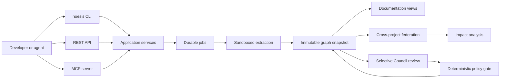

# CodeNoesis Software Architecture

> Status: **the bounded 32-profile V2 architecture is Verified; R18 and R19 are
> Approved and Implemented but not Verified**. Issue #201 / Decision 0041
> defines a verification-only 34-profile V3 candidate without changing product,
> server, workflow, release, support, or GA architecture.

This document is the implementation baseline for the [CodeNoesis software track](README.md). Research-only ideas must first define an experiment and acceptance evidence in the [research track](../research/README.md); they enter this architecture only through an explicit engineering decision.

## System context

CodeNoesis will turn repository revisions and related contracts into immutable, evidence-backed knowledge snapshots. Documentation, federation indexes, and impact reports are materialized views over the canonical graph rather than independent sources of truth.



## Architectural style and dependency rules

The planned codebase is a Cargo workspace organized as a hexagonal modular monolith. Crates enforce boundaries; deployable binaries compose them.

```text
codenoesis/
├── crates/
│   ├── core/
│   │   ├── codenoesis-domain
│   │   ├── codenoesis-contracts
│   │   ├── codenoesis-ports
│   │   ├── codenoesis-application
│   │   └── codenoesis-policy
│   ├── ingest/
│   │   ├── codenoesis-repository
│   │   ├── codenoesis-extractor-core
│   │   ├── codenoesis-tree-sitter
│   │   ├── codenoesis-lang-c-family
│   │   ├── codenoesis-lang-java
│   │   ├── codenoesis-lang-kotlin
│   │   ├── codenoesis-lang-rust
│   │   ├── codenoesis-lang-js
│   │   ├── codenoesis-contract-extractors
│   │   ├── codenoesis-scip
│   │   └── codenoesis-plugin-host
│   ├── knowledge/
│   │   ├── codenoesis-ontology
│   │   ├── codenoesis-graph
│   │   ├── codenoesis-federation
│   │   ├── codenoesis-impact
│   │   ├── codenoesis-docs
│   │   ├── codenoesis-query
│   │   └── codenoesis-council
│   ├── adapters/
│   │   ├── codenoesis-store-sqlite
│   │   ├── codenoesis-store-postgres
│   │   ├── codenoesis-artifact-fs
│   │   ├── codenoesis-artifact-s3
│   │   ├── codenoesis-llm
│   │   ├── codenoesis-auth
│   │   └── codenoesis-telemetry
│   └── interfaces/
│       ├── codenoesis-cli
│       ├── codenoesis-http
│       └── codenoesis-mcp
├── bins/
│   ├── noesis
│   ├── codenoesisd
│   ├── codenoesis-worker
│   ├── codenoesis-sandbox
│   └── codenoesis-migrator
└── wit/extractor.wit
```

Dependency constraints:

- `codenoesis-domain` contains entities, value objects, invariants, and domain errors. It must not depend on Tokio, SQLx, Axum, MCP, filesystem APIs, or an LLM SDK.
- `codenoesis-contracts` owns versioned serializable wire and artifact types.
- `codenoesis-ports` owns traits for repositories, stores, jobs, clocks, policy, models, and artifact publication.
- `codenoesis-application` implements use cases and transaction boundaries. CLI, HTTP, and MCP handlers contain no business logic.
- Ingest and knowledge crates depend inward on core contracts and ports; adapters implement ports; binaries perform composition.
- Rust `unsafe` is forbidden in first-party crates by default. Any unavoidable FFI is isolated in a reviewed boundary crate.
- Libraries use typed errors; human-oriented aggregation is limited to binary entry points.
- Tokio handles bounded asynchronous I/O. CPU-heavy parsing is dispatched to bounded worker pools so it cannot starve the runtime.

The initial toolchain target is stable Rust 1.97.x, edition 2024, Cargo resolver 3, with the exact patch version and `Cargo.lock` pinned at workspace bootstrap. Toolchain updates require CI validation against the [official release notes](https://doc.rust-lang.org/stable/releases.html).

## Canonical knowledge model

The canonical representation is a typed property graph scoped to an immutable repository snapshot. Generated prose, RDF, embeddings, and search indexes are reconstructable projections.

### Core entities

- Workspace, project, repository, revision, and snapshot.
- Module, package, namespace, file, symbol, type, and function.
- Service, endpoint, event, data model, configuration key, dependency, and deployment unit.
- Document, claim, evidence, and review decision.

### Core relationships

- Structural: `CONTAINS`, `DEFINES`, `IMPORTS`, `IMPLEMENTS`.
- Behavioral: `CALLS`, `READS`, `WRITES`, `PRODUCES`, `CONSUMES`.
- Architectural: `DEPENDS_ON`, `EXPOSES`, `CLIENT_OF`, `CONFIGURED_BY`, `DEPLOYS`.
- Epistemic: `DERIVED_FROM`, `SUPPORTED_BY`, `CONTRADICTED_BY`, `REVIEWED_BY`.
- Federation and impact: `SAME_AS`, `AFFECTS`.

### Claim states

- `deterministic_fact`: produced by a parser, compiler index, or authoritative contract;
- `derived_fact`: produced by a versioned deterministic Rust rule;
- `candidate`: heuristic or model proposal awaiting a gate;
- `reviewed_inference`: accepted by the Council policy but still distinct from a deterministic fact;
- `confirmed`: confirmed by deterministic evidence or an authorized human;
- `rejected` and `superseded`: retained for provenance rather than deleted.

An LLM response cannot directly create `deterministic_fact` or `confirmed` state.

### R10 declaration-alternative boundary

The explicit `rust-cfg-declaration-alternatives-v1` S4 profile is an additive
source-only branch over the R5 declaration model. It is not layered on R6,
R7, or K1. The adapter first extracts the same R5 method occurrences and exact
evidence, then an inward-owned deterministic rule groups only repeated methods
that share the complete logical identity/context and satisfy the direct-`cfg`,
same-file/blob, non-overlap, and resource predicates fixed by Decision 0021.

The canonical V9 graph keeps one existing R5 logical `rust.method`. It removes
occurrence-specific shape from that logical node, records
`declaration_state = alternatives`, and links sorted
`rust.declaration_alternative` entities through
`HAS_DECLARATION_ALTERNATIVE`. Each alternative is independently grounded by
its declaration and attribute evidence. Existing logical and `DEFINES` subject
identities stay stable while their claims aggregate all declaration evidence.
No source order or ordinal enters alternative identity.

This boundary deliberately models syntax rather than a configuration solver.
It does not evaluate `cfg`, choose an active declaration, prove predicates
exclusive or exhaustive, invoke Cargo or `rustc`, expand macros, infer types or
values, or manufacture compiler/runtime truth. Invalid grouping is a typed
ErrorV17 failure before publication, never a best-effort merge.

RepositorySnapshotV12, KnowledgeGraphV9, and ExtractionChunkV9 receive new
semantic hash domains and are stored through the existing atomic local-store
protocol. LocalQueryResultV7 exposes direct alternative neighborhoods.
PortableGraphV3 performs a lossless strict projection; LocalExplorerV3 reuses
the immutable first-party K1 viewer bytes under a new manifest without gaining
network, mutation, browser-launch, or execution authority. Older snapshot,
query, portable, explorer, identity, hash, error, fixture, golden, and viewer
bytes remain separate dispatch families.

### R11 callable repository-boundary composition

The explicit R11 S4 composition combines the existing
`rust-callable-semantics-v1` source profile with `local-gitlinks-v1` without
changing either extractor's truth rules. The application layer acquires and
validates the R2 report first, passes only canonical external path/boundary-ID
pairs into the R6 lineage used by K1, and then publishes one additive V13
snapshot. Nested repository source never enters inventory or extraction.

RepositorySnapshotV13 carries the exact boundary report beside the complete
root K1 projection. KnowledgeGraphV10 preserves K1 kinds and identities; a
boundary is not converted into a code entity and no edge crosses into nested
source. QueryV8 and deterministic docs expose boundary state and evidence.
PortableGraphV4 preserves that validated report without source contents,
snippets, raw URLs, credentials, or absolute roots. LocalExplorerV4 reuses the
immutable K1 viewer bytes.

ConfigurationV10, ExtractionChunkV10, KnowledgeGraphV10, and V13 use separate
semantic hash domains. K1 without the boundary selector remains V11. R10 and
R7 do not compose in R11. Invalid composition or any boundary/acquisition
failure is typed ErrorV18 and cannot publish a partial head.

### R12 callable cfg-alternatives composition

The explicit R12 S4 composition combines the existing R10 declaration-
alternative lineage, R6 framework declaration projection, and K1 callable
semantics without changing any extractor's truth rules. R10 remains the
authority for one logical method and its evidence-backed declaration
alternatives. The application layer maps each accepted callable occurrence to
its exact alternative and uses that alternative ID as the K1 callable subject.

An alternative-bearing logical method receives no direct signature, parameter,
body fact, or `CALLS` edge. Each alternative has exactly one signature and its
own ordered parameters and body-syntax facts. Existing K1 preimages are reused
with the alternative subject, so no source order or occurrence ordinal enters
identity. Non-alternative K1 subjects and R6 declarations remain unchanged.
`CALLS` still requires one uniquely known local free-function target and does
not imply an active `cfg` world or method dispatch.

RepositorySnapshotV14 carries both inherited indexes plus the exact
`codenoesis.callable-cfg-alternatives-index/v1` join projection.
KnowledgeGraphV11, ExtractionChunkV11, and ConfigurationV11 use new semantic
hash domains. LocalQueryResultV9 exposes direct logical/alternative/callable
neighborhoods. PortableGraphV5 is a lossless private projection and
LocalExplorerV5 reuses immutable K1 viewer bytes.

The existing R2 boundary report and R9 output capacity are optional in R12.
They grant no nested-source or semantic authority. K1 alone remains V11, R10
alone remains V12, and K1 plus boundaries without R10 remains V13. R7/SCIP does
not compose. Once all R10, R6, and K1 selector flags express R12 intent,
invalid joins or selector combinations are typed ErrorV19 and cannot publish a
partial head. Incomplete R10 plus only R6 or only K1 combinations remain in the
immutable R10 ErrorV17 dispatch lane.

### R13 callable and revision-bound SCIP composition

The explicit R13 S4 composition combines the existing K1
`rust-callable-semantics-v1` source projection with one already validated R7
`scip-rust-v0.9.0-import-v1` overlay over the same immutable repository,
revision, root tree, inventory, and R6 source lineage. Neither extractor gains
new truth authority and CodeNoesis does not generate the compiler index.

One additive `HAS_COMPILER_SYMBOL` relationship is emitted only when an R7
`in_repository_bound` compiler symbol already identifies one exact K1
`rust.function` or `rust.method`, that callable has exactly one K1
`HAS_SIGNATURE`, the symbol has one committed definition locator and one
compiler definition locator, and no second compiler symbol claims the same
callable. The relationship carries those exact two evidence IDs. Its meaning is
limited to revision-bound definition correspondence; it does not prove type
equivalence, call resolution, dispatch, active configuration, generated source,
control flow, data flow, reachability, side effects, ownership, or runtime
behavior.

RepositorySnapshotV15 and KnowledgeGraphV12 are canonical identity-unions of
the complete unchanged K1 and R7 families plus the additive joins. A duplicate
identity is accepted only when its complete canonical JSON record is equal;
otherwise composition fails before publication. The sorted
`codenoesis.callable-compiler-join-index/v1` projection records the source
callable, its K1 signature, compiler symbol, and join relationship and must
equal the graph projection exactly. ConfigurationV12, ExtractionChunkV12, and
the V15/V12 family use separate semantic hash domains.

LocalQueryResultV10 exposes callable, signature, compiler-symbol, and join
neighborhoods. PortableGraphV6 is a lossless private V15 projection and the
historical LocalExplorerV6 implementation reused the immutable K1 viewer
bytes. R7 alone remains V10 and
K1 alone remains V11. R10/R12 declaration alternatives, R2/R11 repository
boundaries, nested source, and the R9 output-capacity selector do not compose in
R13. Complete R7 plus K1 intent selects typed ErrorV20 failures and cannot
publish a partial head; incomplete or selector-absent intent retains the
immutable prior dispatch families.

### R14 Rust expression and lexical bindings

Protected merge #163 made this profile Approved and Implemented, but it remains
not Verified pending independent acceptance of the complete retained evidence.
Decision 0025 and its semantic bundle remain byte-identical historical
checkpoint artifacts; Decision 0026 records the post-merge lifecycle and the
bounded R5 neutral-element correction.

The explicit R14 S4 profile extends only the complete K1 source-only lineage.
The Rust adapter walks each already accepted callable body with the pinned
tree-sitter grammar and emits a closed set of selected expression nodes,
ordered arguments, field-call receivers, supported pattern bindings, and
uniquely proven lexical identifier access. It never invokes Cargo, rustc,
macro expansion, a compiler index, a model, or target code.

The language adapter produces an `ExpressionBindingKnowledge` overlay owned by
the domain. Each `rust.expression`, `rust.call_argument`, and
`rust.pattern_binding` carries a disjoint deterministic identity and exact
committed-source evidence. The domain validates selected parenthood, callable
ownership, contiguous argument ordinals, scope, evidence, endpoints, limits,
canonical order, and the exact `codenoesis.expression-binding-index/v1`
projection before the application layer may compose it with K1.
Expression lexical depth is derived solely as the direct selected-parent
ancestor count, with root `0`; it is not control-flow or runtime depth.

`READS` and `WRITES` are emitted only for identifier/self expression
occurrences that resolve uniquely under the closed lexical scope model. A
direct assignment target writes; a compound target reads and writes; ordinary
value positions read. These relationships describe parse position only. They
do not establish def-use, reaching definitions, data flow, mutation success,
side effects, borrow/ownership, dispatch, value evaluation, reachability, or
runtime execution. Unsupported or ambiguous patterns/scopes remain explicit
coverage gaps without guessed edges.

RepositorySnapshotV16 and KnowledgeGraphV13 preserve every K1 record and append
only the validated R14 overlay. ConfigurationV13, ExtractionChunkV13, and the
V16/V13 family use new semantic hash domains. LocalQueryResultV11 exposes
expression, argument, binding, and access neighborhoods. PortableGraphV7 is a
lossless private V16 projection, and LocalExplorerV7 reuses immutable K1 viewer
bytes. K1 alone remains V11. The optional existing 64 MiB selector changes only
final snapshot capacity; repository-boundary, cfg-alternative, compiler/SCIP,
nested-source, generated-source, and R11-R13 compositions fail with ErrorV21
before acquisition or publication.

### Empty R5 additive neutral element

R5 is an additive declaration layer over complete R4 knowledge, not an
independent repository-existence proof. A valid inherited R4 graph with at
least one source extraction chunk may therefore have zero additive R5 member
entities, relationships, and claims when both R5 index families are empty and
all existing evidence, capability, ordering, identity, reference, and index
invariants hold. This is the algebraic neutral element for the R5 overlay.

The language adapter remains responsible for emitting every supported field,
variant, constant/static, associated type, and implementation-context method.
The domain accepts an empty overlay only after validating the complete inherited
knowledge and chunks; it never creates a placeholder. R6, K1, and R14 consume
that validated neutral result normally and may add only their own
evidence-backed facts. Missing inherited knowledge, missing chunks,
inconsistent empty collections, omitted declarations, dangling evidence, or
invalid indexes still fail before publication.

### R15 closed Rust local flow

Issue #166 and Decision 0027 define a Proposed high-risk S4 candidate over the
exact R14 source-only lineage. Before protected manual merge it is branch-
scoped implementation authority, not an Approved or Implemented fact on
`main`. The explicit selector is `rust-local-flow-v1`.

The language adapter parses each already accepted R14 callable as one closed
unit. A callable that contains only initialized single-binding lets, direct or
compound assignment, normal R14 expression statements or tails, and explicit
non-empty `if`/`else` branches receives a `LocalFlowKnowledge` overlay. Any
unsupported or ambiguous construct rejects the whole callable from R15 while
preserving inherited facts and adding typed coverage. Partial control-flow
graphs are forbidden.

The domain owns `rust.syntax_basic_block`, direct block membership and
condition edges, possible normal source-successor edges, their strict
transitive closure, and lexical must/may reaching-definition facts over exact
R14 `READS`/`WRITES`. It validates disjoint identities and evidence, block
partitioning, acyclicity, closure, reaching sets, canonical order, limits, and
the complete `codenoesis.local-flow-index/v1` derivation projection before the
application layer may publish V17.

ConfigurationV14, ExtractionChunkV14, KnowledgeGraphV14, and
RepositorySnapshotV17 use new semantic hash domains and preserve the complete
R14 graph. LocalQueryResultV12 exposes flow neighborhoods and derivation
inputs. PortableGraphV8 retains the local-flow index losslessly, and
LocalExplorerV8 reuses immutable K1 viewer bytes. Omitting the selector remains
byte-identical R14. The inherited compiler/runtime reachability and data-flow
gaps remain present because syntax-normal progression and lexical reaching
definitions do not establish compiler CFG, executable validity, runtime
execution, values, types, ownership, aliasing, or side effects.

### R14/R15 real-repository correction boundary

Issue #170 and Decision 0029 define one high-risk S4 correction over the exact
accepted R14/R15 source-only lineage. Protected merge #171 made the correction
Approved and Implemented, but not Verified. The Rust adapter preserves simple K1 call
target spelling and replaces every complex receiver or call target with a
bounded placeholder; arbitrary receiver source and URL-looking literals never
enter public target spelling. R14 processes only callables authorized by an
inherited K1 signature and omits complete argument/receiver/initializer edge
families when their source node is outside the selected grammar. R15 likewise
processes only inherited R14/K1 signatures. Unsupported inherited callables
retain the existing whole-callable typed gaps.

The explicit `local-snapshot-256m-v1` selector is accepted only by complete
R14/R15 source-only scans. It changes only the canonical output writer bound to
268,435,456 bytes including LF; ConfigurationV13/V14 keep
`output_capacity_profile = null`, so the semantic payload, identities, hashes,
graph counts, and downstream projections remain unchanged. R14/R15 still do
not compose with repository boundaries: a gitlink is mapped to the existing
typed `repository_boundary_not_supported` input failure before store creation.
No schema, identity domain, ontology family, dependency, nested traversal, or
compiler/runtime authority is added.

### R16 bounded safe Rust constant evaluation

Issue #172 and Decision 0030 defined the Proposed high-risk S4 candidate over
the exact corrected R15 source-only lineage. Protected PR #173, merged as
`c3d05994a56e747fbe3157173998f8ac76ef7333`, made that exact package Approved
and Implemented, but not Verified. Decision 0030 and its retained checkpoint
artifacts remain immutable historical branch-scoped Proposed material. The
explicit selector is `rust-safe-constant-evaluation-v1`. The complete R15
application path first produces and validates its ordinary source graph. The
Rust adapter then provides a bounded `ConstantEvaluationKnowledge` overlay for
existing K1 declared values only; it does not replace, reinterpret, or mutate
R15 domain facts.

The inward domain owns the closed primitive type catalog, checked value model,
evaluation dependencies, `rust.evaluated_value`, `EVALUATES_TO`, typed gaps,
stable identities, and `codenoesis.constant-evaluation-index/v1`. It validates
one result per declared value, canonical decimal/boolean values, exact type
authority, claim/evidence/dependency provenance, acyclicity, ordering, limits,
and the all-or-nothing fixed-repr enum rule before publication. Unsupported
syntax remains a successful extraction with an explicit gap and zero guessed
facts.

The language adapter may inspect only the already acquired committed UTF-8
Rust source with tree-sitter. It evaluates the closed boolean/integer grammar
in a fixed-width checked interpreter and resolves only one unqualified unique
same-owner constant dependency. It cannot invoke Cargo, rustc, build scripts,
proc macros, target code, processes, networking, plugins, models, or browsers;
it cannot infer types, targets, active `cfg`, layout, ownership, side effects,
or runtime behavior.

ConfigurationV15, ExtractionChunkV15, KnowledgeGraphV15, and
RepositorySnapshotV18 use new semantic hash domains and preserve the complete
corrected R15 graph. LocalQueryResultV13 exposes evaluated values and exact
derivations. PortableGraphV9 retains the evaluation index losslessly. On the
protected base, LocalExplorerV9 deterministically emits its manifest while its
K1-derived browser still accepts only `codenoesis.portable-graph/v2`; loading
the matching V9 graph therefore fails. Omitting the selector remains
byte-identical R15; repository-boundary, cfg-alternative, and SCIP/compiler
composition fails before acquisition.

### LocalExplorerV3-V9 exact-schema correction candidate

Issue [#176](https://github.com/smutti/codenoesis/issues/176) and
[Decision 0031](decisions/0031-s4-versioned-local-explorer-browser.md) define
one Proposed high-risk S4 correction over exact base
`16252f59b2dd2302b3f660268843869a45f8ca87`. It leaves every ontology, query,
portable graph, explorer manifest schema, marker, identity, and V1/V2 viewer
byte unchanged. Only the V3-V9 publishers receive a reviewed template
materialized with one exact expected PortableGraph schema and integrity-pinned
by the existing manifest entrypoint.

The merged correction validates exact version, size, common families,
version-specific indexes, unique identities, and privacy before enabling
inspection. It exposes counts, exact-ID/NFC search, typed filters,
relationships, claims, evidence, derivations, diagnostics, coverage gaps, and
deterministic depth-one/two SVG neighborhoods. Rejection clears all prior
state. CSP remains default-deny with no network, dynamic code, storage,
telemetry, source access, browser auto-launch, mutation, repair, or inference.
Protected PR #177 made the behavior effective; it remains not Verified.

### R17 function-centered context and navigation

Issue [#178](https://github.com/smutti/codenoesis/issues/178),
[Decision 0032](decisions/0032-s4-r17-function-context-navigation.md), and
protected PR #179 define one Approved and Implemented high-risk S4 package over
exact protected merge
`f0d0fc998a9158e7c8e96a5b70c8830a3150dd22`. It adds no ontology family,
identity, snapshot, query version, or PortableGraph version. The explicit
`rust-function-context-v1` selector projects one validated R16 callable into
canonical `FunctionContextV1`; selector absence preserves LocalQueryResultV13
bytes.

The projection service is a pure inward-owned contract operation over one
validated semantic head. It builds indexes by stable identity, verifies one
callable root and one `HAS_SIGNATURE`, orders contiguous `HAS_PARAMETER`
subjects, follows only direct `HAS_BODY_FACT` and proven `CALLS`, retains
applicable claims/evidence/diagnostics/gaps/derivations, and emits deterministic
navigation roles. It rejects dangling, duplicate, inconsistent, non-canonical,
private, or over-limit input rather than repairing or inferring it. No source
retrieval, compiler, type/dispatch resolution, cfg selection, ownership,
side-effect, returned-value, or runtime authority enters the domain.

The additive LocalExplorerV10 publisher accepts exactly canonical
PortableGraphV9 and materializes a separate integrity-pinned static asset. The
browser independently validates schema, families, references, privacy, and
size before enabling search. It renders declared signatures, ordered
parameters, outputs, calls, body facts, evidence, claims, uncertainty, and a
bounded SVG neighborhood with text-only DOM operations, deterministic URL
fragments, and 128-entry in-memory history. It has no network, storage,
clipboard, dynamic-code, source, process, mutation, repair, inference, model,
or browser-launch authority.

R17 is exposed only by the source-build `local-experimental-r17` profile. That
profile starts G0 classification but grants no GA, signing, support, release,
deployment, publication, or compatibility promise. Protected PR #179 made the
behavior effective; the exact 32-profile LocalBaselineVerificationV2 package
made the bounded behavior Verified through protected PR #189 without changing
Decision 0032 or its artifacts.

### R18 trusted local evidence-to-source retrieval

Issue [#190](https://github.com/smutti/codenoesis/issues/190) and
[Decision 0038](decisions/0038-s4-trusted-local-source-retrieval.md) define one
high-risk S4 package on exact Verified base
`1de6a420f25a1c7eb74d07a99f1800dde90eefa8`. The explicit
`trusted-local-source-v1` command is an output adapter over a focused
application service and the existing inward-owned repository-acquisition port.
It adds no domain entity, relationship, claim, evidence, snapshot, query,
portable graph, explorer, persistence, or release-profile version.

The CLI loads and validates one visible RepositorySnapshotV18 and passes only
its exact evidence record and immutable source binding inward. The application
service asks the existing local Git adapter to reacquire the explicit repository
at the exact snapshot commit, then verifies repository identity, commit, tree,
path, blob OID, and half-open byte span against the returned bounded inventory.
The evidence path is compared as data and is never joined to a mutable
working-tree root. Loose and explicitly selected packed-object acquisition keep
their existing integrity, path, symlink/reparse, race, and resource checks.

The inward contract emits one canonical `TrustedSourceExcerptV1` only for a
non-empty UTF-8 span on scalar boundaries. It computes one-based line and
Unicode-scalar columns, exact byte length and SHA-256, and fixes authority to
`explicit_local_git_object_only` and disclosure to
`explicit_transient_stdout`. The output adapter buffers and validates the
complete value under the 524,288-byte stdout bound before one write. Typed
`CodeNoesisErrorV29` failures contain no source text or absolute root and cause
no store, repository, artifact, process, network, model, clipboard, browser,
telemetry, signing, publication, or release effect.

The retained LocalBaselineVerificationV2 marker
“LocalBaselineVerificationV2 candidate Verified pending independent review and
protected manual merge” remains immutable pre-activation evidence, while PR
#189 is the external V2 activation event. Issue #141 is closed as superseded.
Protected PR #191 made R18 Approved and Implemented, but it remains not
Verified pending independent acceptance of LocalBaselineVerificationV3.

### R19 Git-backed implementation-aware semantic impact

Issue [#196](https://github.com/smutti/codenoesis/issues/196),
[Decision 0040](decisions/0040-s7-git-backed-semantic-impact-evidence.md), and
protected PR #197 add only the explicit
`implementation-aware-http-json-git-v1` path. It binds provider/client
implementation evidence and bounded source excerpts to immutable local Git
objects while preserving the accepted V1 report and all prior product bytes.
The inward comparison remains deterministic and evidence-backed; the adapters
retain path, race, UTF-8, privacy, output, and no-side-effect boundaries.

R19 is Approved and Implemented but not Verified. Issue #201 and Decision 0041
bind R18/R19 to the immutable V2 baseline in one exact pre-activation marker:
“LocalBaselineVerificationV3 candidate Verified pending independent review and
protected manual merge”. G9 remains a separate governed package.

### G0 bounded release-profile registry

Issue [#180](https://github.com/smutti/codenoesis/issues/180),
[Decision 0033](decisions/0033-g0-release-profile-registry.md), and protected
PR #181 made `FR-REL-001` and `FR-CLI-007` Approved and Implemented but not
Verified for one critical S14 package. The inward-owned
contract embeds one closed `local-experimental-r17` definition and selects a
platform only from compile-time `cfg`. The output boundary emits canonical
`ReleaseProfileV1`; invalid command/profile/target state emits only
`CodeNoesisErrorV25`.

The composition root installs the inherited S0 boundary before dispatching the
output-only `profile` command. The command reads no repository, path,
environment selector, credential, release key, or network resource and writes
no store or artifact. Linux x86_64 carries the normative seccomp/Landlock tier;
macOS arm64 and Windows x86_64 remain functional-portability-only tiers. Every
other target fails closed before profile publication.

The registry records signing and attestation as unavailable, release
provenance/publication/deployment/secrets as false, support as none, and
distribution as source-build-only. It is not a release subsystem. G1, G2, G5,
G8, and G9 retain authority over distribution, compatibility, security,
supply-chain release evidence, support, and GA.

### G1a local configuration and staged distribution

Issue [#182](https://github.com/smutti/codenoesis/issues/182),
[Decision 0034](decisions/0034-g1a-local-cli-distribution-configuration.md)
and protected PR #183 made `FR-CFG-001`, `FR-REL-002`, and `FR-CLI-008`
Approved and Implemented but not Verified for one high-risk S14 package. The
inward contract owns a closed fixed-policy
`LocalCliConfigurationV1`, canonical `LocalConfigurationReportV1`, canonical
`LocalDistributionManifestV1`, and strict `CodeNoesisErrorV26`.

The composition root resolves an optional leading explicit configuration or
the embedded default before dispatch. Explicit input is a stable bounded
regular non-symlink file. No environment, home/system/current-directory,
registry/plist, network, merge, include, interpolation, inheritance, repair,
or secret reference participates. Selector absence preserves the established
command path and bytes.

The repository-maintenance `xtask` adapter accepts one already-built local
binary and one explicit empty output root. It derives the current target from
compile-time `cfg`, validates the G0 target set, stages a six-file directory in
the output filesystem, and renames it into a digest-named final path only after
all payload and manifest checks pass. It does not build source, resolve
dependencies, install globally, mutate PATH or operating-system state, sign,
publish, deploy, or create release authority.

The bundle is installed and upgraded side by side as a complete immutable
directory. Activation remains an explicit caller-owned path; rollback selects
the retained previous digest path and uninstall removes only an explicitly
selected directory. There is no launcher, service, hidden `current` pointer,
package database, automatic updater, or server artifact. G1 remains incomplete
until its remaining local and server distribution, secret, release-channel,
and supported-installation semantics are separately approved.

### Local Upgrade Safety

Issue [#184](https://github.com/smutti/codenoesis/issues/184),
[Decision 0035](decisions/0035-local-upgrade-safety.md), and protected PR #185
made `FR-CMP-001` and `FR-CLI-009` Approved and Implemented but not Verified
for one high-risk G2a/G5-local/G7a S14 package.
The inward contract owns canonical `LocalUpgradePlanV1`,
`LocalRollbackReportV1`, and strict `CodeNoesisErrorV27`. The repository
maintenance adapter owns stable filesystem reads of two complete G1a bundles
and one optional exact prior plan; compatibility policy and report construction
remain filesystem-independent.

The adapter validates exact bundle names, manifests, payloads, modes, digests,
targets, profiles, configuration authority, tree membership, and pre/post-read
file identities. Upgrade succeeds only for two distinct same-target G1a
bundles and states that no migration is required for the identical immutable V1
configuration. Rollback succeeds only when the exact prior plan binds current
and retained bundle digests. Arbitrary downgrade, substitution, tampering,
symlinks, races, unknown contracts, and excess input fail closed.

Both commands are output-only. They do not activate a bundle, execute either
binary, mutate a path, create a hidden pointer, migrate product data, read a
secret source, open network, sign, publish, or establish support or GA. The
G7a runner is observational only and does not resolve `NFR-PER-002` or
`OD-SLO-001`.

### Real-world Rust stability benchmark candidate

Issue [#205](https://github.com/smutti/codenoesis/issues/205) and
[Decision 0042](decisions/0042-real-world-rust-stability-benchmark.md) define
one Proposed B1/G7/S14 benchmark boundary. The standard-library runner is an
external measurement adapter around an explicitly supplied release `noesis`
binary and two caller-supplied full local Git clones. It owns immutable Git
preflight, fresh marker-owned stores, child-process timing, bounded output
capture, semantic/outcome validation, canonical reports, and same-host report
comparison. It owns no product extraction rule or ontology meaning.

The runner may invoke only sanitized local Git inspection and the explicit
`noesis` binary. It never clones, fetches, checks out, initializes submodules,
builds, executes target code, opens network, loads a model, starts a browser,
or mutates source repositories. Lekton is the positive R16 semantic oracle;
RustDesk is the typed repository-boundary negative. Three baseline and three
candidate samples are retained without retry or discard.

The comparator rejects semantic or typed-outcome drift, incomplete samples,
host/corpus/config mismatch, p95 above the reviewed same-host regression
boundary, and absolute observational ceilings. The active manifest links only
`NFR-PER-001`. This package does not resolve `NFR-PER-002` or `OD-SLO-001` and
does not make release-artifact, availability, support, conference, cross-host,
or GA claims.

### G1b/G8-local verifiable distribution candidate

Issue [#186](https://github.com/smutti/codenoesis/issues/186) and
[Decision 0036](decisions/0036-local-verifiable-distribution.md) define
Proposed `FR-REL-003` and `FR-CLI-010` for one critical S14 package. Existing
G0, G1a, and G2a contracts remain immutable. The new boundary wraps one exact
G1a directory in an outer deterministic release-candidate carrier without
changing the embedded runtime profile or configuration.

The inward contract owns canonical candidate manifest, verification, supply
evidence, and `CodeNoesisErrorV28` values. The repository-maintenance adapter
owns stable filesystem reads, deterministic stored-entry ZIP writing, complete
ZIP revalidation, digest-named atomic publication, and read-only verification.
It accepts only one known six-file G1a tree and exact target/source/lock/policy
evidence. It rejects traversal, symlinks, devices, duplicates, malformed ZIP,
CRC/SHA/mode/length mismatch, evidence substitution, races, private values, and
resource excess rather than repairing or inferring.

The supply generator is a release adapter, not domain authority. It normalizes
target-filtered locked Cargo metadata, exact Cargo.lock identity, reviewed
license expressions, current cargo-audit output, transitive lexical unsafe
surface, and CycloneDX 1.6 structure into privacy-safe canonical evidence.
Advisory database time is observational; fixed normalized inputs alone carry a
byte-reproducibility claim.

The trusted workflow separates unprivileged supply/build jobs from a
GitHub-hosted attest job with only contents-read, OIDC, and attestation-write.
The privileged job executes no repository, dependency, or candidate program.
It activates only after protected merge and explicit main dispatch. The local
verifier never claims Sigstore trust; consumer identity and provenance checks
remain the exact external `gh attestation verify` boundary.

No tag, release, package, image, deployment, environment, secret, signing key,
support window, EOL, release channel, vulnerability-response SLA, or GA
authority enters this package. Post-merge three-platform attestation evidence
and independent acceptance remain required before Verified.

### S7 implementation-aware runtime boundary

Protected merge #169 made the issue #168 and Decision 0028 high-risk S7 C0-C4
runtime Approved and Implemented, but not Verified, on the exact R15 baseline.

The output-only `noesis impact` interface accepts one explicit
`ImpactWorkspaceV1`. That manifest is the complete filesystem and revision
authority for provider baseline and target sources, Kotlin/KMP client sources,
and one already materialized S6 federation report. The command performs no
repository discovery, store publication, network access, build, target,
compiler, Gradle, plugin, model, test, or runtime execution. Success buffers and
validates one immutable `SemanticCompatibilityReportV1`; failures emit only a
typed `CodeNoesisErrorV23` and never a partial report.

Source adapters are inward-facing evidence producers. The Rust adapter exposes
only `rust-direct-json-map/v1`; the Kotlin adapter uses the pinned
`tree-sitter-kotlin-ng = 1.1.0` grammar and exposes only
`kotlin-direct-json-access/v1`. They return closed capability facts and gaps to
the impact domain; they do not classify compatibility, write public streams, or
gain ambient filesystem authority. The impact domain validates the exact S6
operation binding, preserves `declared_contract`, `provider_implementation`,
and `client_assumption` as separate views, and applies only the immutable
Decision 0007 rule catalog. Unsupported semantics remain `unresolved` with
coverage and never become compatible or breaking by default.

The pipeline registration is `codenoesis.pipeline/s7-v1`. The accepted golden
retains its historical `codenoesis.pipeline/semantic-impact/v1` report field;
the runtime must reproduce those exact bytes rather than migrate or regenerate
the oracle. Stable-handle reads, SHA-256 revalidation, fixed limits, canonical
ordering, digest-only excerpts, and no raw source projection enforce the
authority, race, privacy, and determinism boundary.

## Versioned artifacts and identity

All public artifact types include `schema_version`, repository commit, configuration hash, pipeline version, ontology version, extractor versions, creation time, and a BLAKE3 content hash.

Planned contracts:

- `RepositorySnapshotV1`
- `ExtractionChunkV1`
- `KnowledgeGraphV1`
- `ProvenanceV1`
- `CrossProjectLinksV1`
- `ImpactReportV1`
- `CouncilEvidencePackV1`
- `CouncilVerdictV1`
- `DocumentBundleV1`
- `JobV1`

Identifiers use validated newtypes such as `WorkspaceId`, `ProjectId`, `RevisionId`, `SnapshotId`, `EntityId`, `EvidenceId`, `ClaimId`, and `JobId`. Stable entity identifiers derive from canonical project identity, language, symbol identity, and versioned normalization rules rather than database sequence numbers.

The analysis idempotency key is computed from:

```text
workspace + project + commit + build_profile
+ configuration_hash + pipeline_version
```

The system writes only the current schema and reads the current and immediately previous schema. Older data requires an explicit migration or rebuild. Publishing a snapshot and advancing `project_head` is atomic.

## Extraction and plugin model

### Built-in extraction

- The baseline parser layer uses the official [Tree-sitter Rust bindings and parser model](https://tree-sitter.github.io/tree-sitter/using-parsers/).
- Dedicated adapters normalize C/C++, Java, Rust, JavaScript, and TypeScript syntax into common extraction contracts.
- Contract extractors cover OpenAPI, AsyncAPI, GraphQL, Protocol Buffers, Maven/Gradle, Cargo, npm, containers, Kubernetes, Backstage metadata, and CODEOWNERS.
- Compiler-grade symbol and relationship data can be imported using [SCIP](https://github.com/sourcegraph/scip). A validated compiler/indexer edge outranks a syntax-only heuristic.
- Standard scans never execute build scripts or target binaries and never follow a submodule or symlink beyond the allowed repository roots.

### Extension model

Built-in adapters are statically compiled Rust implementations of internal traits. Third-party in-process Rust dynamic libraries are excluded because Rust has no stable dynamic ABI.

Portable plugins use the WebAssembly Component Model and a versioned WIT contract. The [Wasmtime Component API](https://docs.wasmtime.dev/api/wasmtime/component/index.html) provides the intended host. Each invocation receives explicit capabilities and defaults to:

- read-only access to a bounded repository view;
- no network access;
- bounded memory, CPU fuel, wall time, and output size;
- deterministic clock and randomness unless a capability grants otherwise;
- structured extraction output validated before ingestion.

Compiler indexers that cannot run as Rust or WebAssembly may operate as optional rootless OCI sidecars. They exchange only versioned SCIP or JSONL artifacts. A separate opt-in `trusted-build` profile is required when an indexer must run repository build tooling.

## Storage profiles

### Local profile

- SQLite in WAL mode with a single application writer.
- Content-addressed artifacts on the local filesystem.
- SQLite FTS5 for text lookup.
- No authentication requirement unless connecting to a server.

### Server profile

- PostgreSQL as the canonical transactional and graph store.
- S3-compatible object storage for large immutable artifacts.
- PostgreSQL full-text search for the initial server search implementation.
- Durable jobs with leases, heartbeats, retries, and an outbox. Workers acquire jobs with `FOR UPDATE SKIP LOCKED`, using the queue-like behavior documented by [PostgreSQL](https://www.postgresql.org/docs/current/sql-select.html).
- Recursive CTE traversal with explicit maximum depth, cycle detection, result limits, and statement timeouts.
- Workspace-scoped rows and PostgreSQL row-level security using default-deny policies.

SQLite and PostgreSQL adapters must pass the same behavioral contract suite. Neo4j, NATS, a vector database, and an RDF store are not baseline dependencies. JSON-LD/RDF and vector indexes may be added as replaceable projections; they cannot become the authoritative store.

## Analysis pipeline

1. Resolve a repository source to an immutable commit SHA and acquire it with enforced size and path limits.
2. Inventory languages, manifests, build systems, contracts, configuration, ownership, and extraction capabilities.
3. Extract AST facts, symbols, calls, imports, contracts, and source locations in isolated, bounded work units.
4. Normalize identities, merge compatible evidence, and construct the project graph.
5. Validate graph invariants, evidence references, artifact schemas, and coverage.
6. Run deterministic inference rules and materialize evidence-backed documentation.
7. Match project entities to the workspace federation graph.
8. Compare revisions and calculate bounded change-impact paths.
9. Route only qualifying ambiguous or high-impact claims through Council review.
10. Atomically publish artifacts, graph snapshot, search index, and generated documents.

Incremental refresh starts from `git diff` and content hashes, invalidating affected files, entities, derived relations, documents, and federation links. Changes to an extractor, normalization rule, ontology, artifact schema, or relevant build profile trigger a full rebuild.

## Federation and impact analysis

Cross-project identity is resolved in descending order of authority:

1. explicit catalog or `.codenoesis.toml` identity;
2. package coordinates and SCIP symbols;
3. operation ID or protocol/service/method/path contract identity;
4. event topic and schema identity;
5. heuristic candidate matching.

Heuristic matches remain candidates until deterministic evidence, governed Council review, or an authorized human confirms them.

For an API change, impact analysis will:

- compare implementation and contract between two revisions;
- classify compatibility as compatible, potentially breaking, or breaking;
- traverse `Service → EXPOSES → Endpoint ← CONSUMES ← Component` and related call paths;
- attach affected repositories, call sites, owners, and deployment units;
- return the evidence path, confidence components, coverage gaps, unknowns, and possible false positives.

## Documentation materialization

Documentation views cover overview, architecture, modules, domain flows, APIs, events, data, configuration, integrations, deployment, runbooks, onboarding, and change impact.

Every generated section contains valid evidence references. Materialization fails or marks a statement unknown if its evidence cannot be resolved. Hand-written documentation may be ingested as evidence but is never overwritten. Repository export is restricted to a configured generated-document directory; server mode can retain documents entirely in the document store.

## Council as a selective epistemic gate

The Council is not a parser, source of truth, or universal pipeline stage. It reviews ambiguous claims only after deterministic analysis.

Public modes:

- `off`: never invoke a Council;
- `auto` (default): policy selects claims based on ambiguity, impact, and available evidence;
- `quick`: three independent seats, at most two rounds, two-of-three quorum;
- `full`: five independent seats, at most two rounds, four-of-five quorum.

Roles are semantic reviewer, evidence verifier, and systemic-impact reviewer, with a falsifier and ontology steward added in `full` mode. The chair is non-voting and cannot create facts.

Controls:

- The first assessment is independent and blind to other seats.
- The immutable, content-hashed evidence pack is bounded and redacted.
- Every citation is machine-checked; an unknown evidence identifier invalidates the verdict.
- Critical evidence-backed dissent or missing quorum returns `needs_human`.
- Seat, round, duration, token, and monetary budgets are hard limits.
- External providers are disabled by default and selected through workspace allowlists.
- Provider failure degrades to deterministic output plus an explicit unresolved claim.
- Council rollout begins in shadow mode and becomes a gate only after calibration against human review.

## Public interfaces

### CLI

```text
noesis init
noesis scan
noesis refresh
noesis docs
noesis federate
noesis impact
noesis query
noesis audit
noesis mcp --stdio
noesis plugin list|verify
```

The CLI supports local execution or `--server`, machine-readable `--format json`, stable documented exit codes, and configuration precedence:

```text
defaults < .codenoesis.toml < CODENOESIS__* environment < CLI
```

### REST

Planned `/api/v1` resources include:

- `POST /projects/{id}/analyses` returning `202` and `JobV1`;
- `GET /jobs/{id}` and `GET /jobs/{id}/events` using Server-Sent Events;
- `GET /entities/{id}`;
- `GET /projects/{id}/documents`;
- `POST /workspaces/{id}/impact`;
- `POST /claims/{id}/reviews`.

Errors follow RFC 9457 Problem Details and add stable `error_code`, `retryable`, `stage`, `job_id`, and correlation ID fields. Mutating calls accept idempotency keys.

### MCP

The MCP boundary uses the [official Rust SDK](https://github.com/modelcontextprotocol/rust-sdk), isolated in `codenoesis-mcp` and protected by version pinning and conformance tests.

Planned tools are `scan_repository`, `refresh_repository`, `query_knowledge`, `analyze_impact`, `review_claim`, and `export_documentation`. Documents, entities, evidence, and impact reports are exposed as resources. Long-running tools always return a `JobId`. Local mode uses stdio; server mode uses Streamable HTTP.

## Runtime, security, and operations

### Process responsibilities

- `codenoesisd`: stateless API/MCP handling, authorization, rate limiting, and bounded queries.
- `codenoesis-worker`: durable pipeline, documentation, federation, impact, and Council jobs.
- `codenoesis-sandbox`: rootless extraction and plugin execution with no ambient authority.
- `codenoesis-migrator`: explicit forward migration and compatibility checks separate from application startup.

### Security baseline

- OIDC/OAuth 2.0, PKCE for an interactive CLI, and service accounts for automation.
- Workspace roles: `owner`, `admin`, `maintainer`, `analyst`, `viewer`, and `automation`.
- TLS in transit, encryption at rest, external secret management, and append-only audit events.
- Short-lived, read-only source-control credentials available only to the acquisition stage.
- Rootless sandbox, read-only filesystems, default-deny networking, and CPU/RAM/disk/time limits.
- Defenses against path traversal, symlink escape, oversized files, archive/repository bombs, malicious parser input, prompt injection, and unbounded graph queries.
- One model gateway enforcing redaction, provider/model/region allowlists, audit, budgets, and a kill switch.

### Reliability and observability

- Structured spans and metrics use Rust `tracing`, with OpenTelemetry confined to a replaceable adapter while Rust signal maturity evolves. See the [OpenTelemetry documentation](https://opentelemetry.io/docs/).
- Required telemetry includes request and job latency, queue depth, stage duration, files per second, graph size, unresolved identities, snapshot freshness, sandbox failures, Council outcomes, token consumption, and model cost.
- Job processing is at-least-once; stage handlers and publication are idempotent.
- PostgreSQL uses point-in-time recovery, daily backups, and a quarterly restore exercise. Initial targets are RPO five minutes and RTO sixty minutes.
- Supply-chain checks include formatting, warning-free Clippy, test/fuzz/coverage gates, [`cargo-deny`](https://github.com/EmbarkStudios/cargo-deny), the [RustSec database](https://rustsec.org/), SBOM generation, signed OCI artifacts, and build provenance.
- Supported deliverables are CLI binaries for Linux, macOS, and Windows and server images for Linux amd64 and arm64.

## Service-level objectives

These are planned GA targets on a reference host with 8 vCPU, 16 GB RAM, NVMe storage, and warm infrastructure. Model-provider latency is reported separately.

| Capability | Target |
| --- | --- |
| Read API availability | 99.9% per calendar month |
| Job submission latency | p95 under 250 ms |
| Entity lookup | p95 under 300 ms |
| Bounded traversal, at most 3 hops over 10 million edges | p95 under 2 s |
| Incremental refresh of 100 changed files | p95 under 60 s |
| Cold scan up to 100k lines of code | p95 under 2 min |
| Cold scan up to 1M lines of code | p95 under 10 min |
| Failed worker recovery | lease reassignment within two lease intervals |
| Snapshot consistency | no partial snapshot visible to readers |

SLOs must be validated using a published benchmark corpus before becoming contractual. Results are segmented by language, repository shape, enabled extractors, and cache state.

## Verification strategy

Before `1.0`, the implementation must include:

- golden repositories for every supported language and at least one polyglot system;
- deterministic replay tests for identifiers and artifact hashes;
- the same storage contract suite against SQLite and PostgreSQL;
- differential Tree-sitter/SCIP fixtures;
- crash, duplicate-job, expired-lease, retry, and atomic-publication tests;
- a cross-project provider, two real clients, and a difficult decoy;
- breaking OpenAPI and event-schema scenarios with expected call sites and owners;
- Council tests for fabricated evidence, correlated agreement, dissent, missing quorum, timeout, and provider outage;
- tenant-isolation, malicious repository, sandbox resource, and plugin trap/OOM tests;
- migration from at least two prior releases plus a complete restore exercise;
- CLI compatibility tests on Linux, macOS, and Windows and load tests for REST and MCP.

## Implementation milestones

1. **Foundation:** ratify ADRs, threat model, artifact schemas, ontology v1, reference fixtures, toolchain, and crate dependency checks.
2. **Local core:** implement acquisition, built-in parsing, SQLite/CAS, CLI, deterministic validation, and atomic snapshots.
3. **Knowledge:** implement rules, documentation, federation, impact analysis, and incremental invalidation.
4. **Server:** implement PostgreSQL jobs, HTTP/MCP, OIDC/RLS, object storage, migrations, backup, and telemetry.
5. **Governed AI:** implement the model gateway, Council shadow evaluation, skill pack, and agent orchestration.
6. **Hardening:** complete security, fuzz, chaos, performance, restore, and multi-repository pilot gates before `1.0`.

No milestone is considered complete solely because code exists: its artifact contracts, failure modes, observability, security controls, tests, and operational documentation must pass the corresponding acceptance gate.
