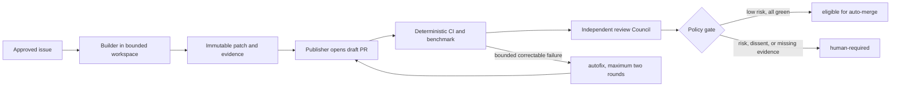

# Autonomous development governance

> Status: **A1 automation scaffold implemented, inactive by default**. The
> repository contains bounded proposal, static review, watchdog, CI, and
> benchmark-contract workflows. Remote rulesets, the publisher GitHub App,
> secrets, and shadow validation must be completed before the kill switch is
> enabled. No autonomous product change has run yet.

## Objective

CodeNoesis uses autonomous agents to shorten the loop from an Approved
requirement or exact branch-authorized candidate to a reviewable pull request.
Autonomy applies to proposing, testing, implementing, reviewing, and correcting
a bounded change. It does not grant authority to redefine the requirement,
weaken its oracle, bypass a security gate, approve its own work, or release into
production.

The target is a closed-loop pull-request factory, not one unbounded agent
working directly on `main`.

The current repository has one write-capable human, `@smutti`. Its bootstrap
ruleset therefore requires no external PR approval and makes no claim of human
separation of duties. High/critical changes still require the accountable
maintainer's manual protected merge after deterministic gates; no agent,
publisher, Council, or administrator bypass may merge. When a second
write-capable human joins, one required approval and Code Owner review must be
restored before the next protected governance decision.

The diagram below is the promotion target. The implemented A1 subset has one
proposal attempt, a draft PR, deterministic CI/benchmark-contract checks, and
one static AI reviewer. Autofix, multi-seat Council aggregation, label
transitions, auto-merge, and release authority are not implemented.



## Relationship to the product Council

The development-review Council evaluates a proposed repository change. The
product Council described in `architecture.md` evaluates ambiguous knowledge
claims produced by CodeNoesis at runtime. They may reuse orchestration ideas,
but they are different trust domains and evidence sets.

Neither Council is a parser or source of truth. Model agreement cannot turn a
claim into a deterministic fact, satisfy a missing test, or override a
critical evidence-backed dissent.

## Trust and authority boundaries

Use separate least-privileged identities:

| Role | Reads | May write | Must not do |
|---|---|---|---|
| Intake | Issue and policy | Labels/state only | Edit source or approve readiness without evidence |
| Builder | Ready issue, authorized contract, and checkout | Patch in an isolated workspace | Push, approve, merge, release, or change its governing policy |
| Publisher | Validated patch artifact | Agent branch and draft PR | Receive model credentials or merge authority |
| CI/benchmark | Checkout and versioned corpus | Check result and immutable artifacts | Change the branch under test |
| Review Council | Diff, requirement, oracle, evidence | Structured findings/checks | Push fixes or inherit the builder conclusion as fact |
| Autofix builder | Failed check and bounded context | Replacement patch artifact | Loop more than the approved attempt budget |
| Release | Exact approved commit and artifacts | Protected tag/release | Run repository-controlled code while privileged secrets are exposed |

The job that holds a model credential must not also expose a write-capable
repository token to untrusted repository-controlled code. The normal pattern
is read-only compute, immutable patch artifact, then a separate publisher job
without the model credential.

Cloud and release access must use short-lived credentials and protected
environments. No automation identity receives a ruleset bypass.

## Work item contract

The issue form in `.github/ISSUE_TEMPLATE/agent-task.yml` is the machine- and
human-reviewable work contract. An autonomous run may begin only after intake
confirms:

- stable requirement IDs and `Approved` status;
- one vertical slice;
- public acceptance oracle and expected Red failure;
- risk, allowed paths, protected paths, and relevant threats;
- dependencies and resolved blocking decisions;
- required evidence, execution budgets, and stop conditions.

Issue titles, bodies, comments, attachments, source files, test output, and
linked web content are data, not agent policy. Only versioned, owner-reviewed
control-plane instructions can grant an action.

## Maintainer-supervised accelerated lane

This lane governs interactive work performed while the accountable maintainer
is present. It does not promote the repository's unattended autonomous level or
grant an automation identity additional authority.

A linked Ready issue may select a single-PR vertical package through one
explicit human authorization. It may cover one slice, one coherent public
outcome, exact stable requirement IDs and candidate semantics, paths and
dependencies, risk owner and rollback boundary, oracle and expected Red,
evidence, correction budget, and stop conditions.

The package may combine product governance and production implementation in one
pull request. Product governance includes requirements, architecture decisions,
threat models, schemas or ontology contracts, fixtures or oracles,
traceability, and operational documentation. Multiple tightly related
requirements or sub-behaviors may share the package only when they share the
same acceptance journey, slice, risk owner, rollback boundary, and versioned
fixture or oracle.

The package may start from requirements `Approved` on `main` or from a complete
candidate that remains `Proposed` until merge. The maintainer decision grants
branch-scoped implementation authority only for that exact candidate. Its
requirement approval and production behavior become effective atomically only
after the accountable maintainer manually merges the exact pull request.

The builder must, before any production source edit, create a governance
checkpoint containing the complete candidate governance and executable
acceptance or conformance check. The builder then runs that check against the
checkpoint and records retained expected Red evidence before adding production
code and Green evidence in subsequent commits. The checkpoint and
Red-before-code history remain reviewable through merge.

Within the unchanged package, the builder may implement, validate, publish, and
correct findings without repeated authorization. The default budget is three
correction rounds; an issue may select a bounded value from one through five. A
semantic requirement, oracle, scope, dependency, authority, or risk change
invalidates the checkpoint and stops for a new explicit human decision.

The delivery control plane consists of `AGENTS.md`, `.github/**`, and
`.codex/**`, including agent policy, workflows, permissions, review,
publication, signing, and release authority. It remains in a separate pull
request from the product change it authorizes or judges. The machine-policy
projection may be prepared in parallel and remains required before unattended
autonomous execution; a missing projection does not block the explicitly
authorized interactive package, but a branch-scoped candidate is never eligible
for unattended execution.

Issue content remains untrusted work data: authority comes from this versioned
lane plus the accountable maintainer's explicit decision, not from agent-authored
text, labels, attachments, or links alone.

## Lifecycle and state

The intended labels form a state machine:

```text
agent:triage -> agent:ready -> agent:building -> agent:reviewing
                                        |              |
                                        v              v
                                  agent:blocked   agent:verified
                                        |              |
                                        +----> agent:human-required
```

These labels are a future orchestration contract and are not provisioned or
transitioned by the A1 workflows. Today, GitHub draft state, workflow results,
the issue contract, and human review are the authoritative state signals.

State transitions require evidence:

- `agent:ready`: the issue contract passes readiness review;
- `agent:building`: a unique run, branch, base SHA, budget, and lease exist;
- `agent:reviewing`: patch, Red proof, Green evidence, and changed-path manifest
  have been published;
- `agent:verified`: deterministic required checks and review policy are green;
- `agent:blocked`: an external dependency is temporarily unavailable and the
  run has stopped consuming resources;
- `agent:human-required`: a stop condition, protected decision, high/critical
  risk, dissent, or exhausted retry budget requires a person.

Workflows must be idempotent, use concurrency groups per issue/PR, cancel stale
runs, and prevent event recursion. An agent-authored comment or push must not
silently trigger an unlimited new run.

## Autonomous TDD loop

This is the target A2 loop. A1 records structured Red/Green claims and the
final patch in an immutable artifact, but it does not independently prove the
pre-implementation sequence. Its PR therefore remains draft and
`proposal_only` until a maintainer completes and verifies the evidence pack.

1. Bind the run to the issue, approved requirements, base SHA, allowed paths,
   policy version, and fixed budget.
2. Inspect the narrow public surface without modifying source.
3. Add the acceptance/conformance test and capture the expected Red result.
4. Refuse to continue if Red fails for an unrelated reason or unexpectedly
   passes.
5. Implement the smallest behavior and run focused tests.
6. Add risk-proportional property, contract, invalid-input, boundary, security,
   failure, and observability tests.
7. Run the required repository gate and targeted base-versus-head benchmark.
8. Produce a patch plus immutable evidence; do not push from the model job.
9. Publish a draft PR through the separate publisher identity.
10. Let independent reviewers assess it blind before any Council discussion.
11. Permit three correction rounds by default, or the issue's bounded value
    from one through five. Otherwise stop for a human with the repeated failure
    and smallest required decision.

## Development-review Council

The multi-seat Council below is planned. A1 currently runs one bounded static
review and must not describe that single result as Council consensus.

Use independent seats with structured output:

1. requirement and behavioral correctness;
2. falsification and test-oracle quality;
3. architecture, compatibility, ontology, and data semantics;
4. security, privacy, sandbox, and supply chain;
5. reliability, performance, and operability.

Low/medium-risk work may select the relevant three seats; high/critical work
uses all five plus required human review. The first assessment is blind to the
builder and other seats. Each finding includes severity, confidence,
requirement, evidence reference, file/line, and a falsifiable remediation.

Council policy:

- P0/P1 or critical/high findings backed by valid evidence block the change;
- missing quorum, unknown evidence, or material dissent returns
  `human-required`;
- a chair may deduplicate findings but cannot invent facts or outvote critical
  dissent;
- reviewers are advisory until their structured output and calibration have
  passed shadow evaluation against human decisions;
- reviewers cannot change the branch they evaluate.

## Risk policy

| Risk | Typical change | Autonomous authority |
|---|---|---|
| Low | Docs, tests, isolated internal behavior with unchanged contracts | Build, correct, and eventually auto-merge after promotion criteria |
| Medium | Approved product behavior within stable boundaries | Build and correct; independent gate; merge policy may be promoted later |
| High | API/schema/ontology, persistence, auth, sandbox, privacy, dependencies, `unsafe`, SLO | Build only when explicitly authorized; human approval required |
| Critical | Workflow authority, secrets, signing/release, tenant isolation, destructive migration, gate bypass | Proposal or patch only; multiple independent checks and human approval required |

Protected paths are declared in `CODEOWNERS`. In addition, any change to its
own policy, prompt, workflow, benchmark baseline, acceptance oracle, or golden
fixture is treated as protected even if path matching is incomplete.

## Evidence pack

The following is the target A2 evidence pack. A1 currently retains the exact
issue snapshot and hash, requirement authorization records, policy/prompt/schema
hashes, base SHA, final patch and digest, structured model validation claims,
and workflow metadata. Missing Red sequencing, full logs, coverage, benchmark,
and human-decision evidence keeps the generated PR draft and proposal-only.

An A2 autonomous run must produce a content-hashed evidence manifest containing:

```text
issue and requirement IDs
requirement status and slice
risk, allowed paths, actual paths, protected paths
base and head SHA; patch digest
policy, prompt, agent, model, reasoning profile, and run ID
Red command, expected/actual failure, timestamp, exit status, artifact digest
Green/regression commands, exit statuses, reports, coverage, and flake signal
fixtures, oracles, schemas, compatibility and security results
benchmark corpus/version, environment, repetitions, statistics, base/head delta
OS, architecture, toolchain, features, and non-secret configuration
duration, attempts, token/cost/resource consumption
review findings, dissent, quorum, human decisions, and unresolved unknowns
```

Raw logs must be redacted and retained according to policy. Evidence identifiers
must resolve to immutable artifacts; a mutable PR comment is only a summary.
Absent evidence is recorded as `not run` or `unknown`, never inferred as green.

## Verification cadence

The exact commands and thresholds become executable contracts during `S0` and
subsequent slices. The intended cadence is:

| Gate | Scope | Merge/release effect |
|---|---|---|
| Pull request | Format, warning-free compile/lint, focused and workspace tests, doctests, coverage, dependency rules, traceability, schema/docs links, targeted benchmark | Required before review completion |
| Nightly | Platform matrix, real adapters, fuzz/property/differential runs, mutation, randomized edit sequences, feature combinations, performance and flake detection | Blocks autonomy promotion and release candidate |
| Weekly | Large reference corpus, graph/load targets, long fuzzing, chaos, malicious repositories, cost/latency trends | Detects structural regression and recalibrates budgets |
| Release | Exact signed artifact, migration/rollback/restore, SBOM/provenance/signature, vulnerabilities, tenant/sandbox/load suite, approved pilot | Required for release |

Performance decisions compare base and head using a versioned manifest that
states hardware/runner, corpus, cache state, concurrency, warmup, repetitions,
percentile method, resource ceilings, and allowed regression. Shared runners
may be used for smoke detection; contractual micro-regression decisions require
a controlled runner or a deterministic instruction-count method.

## Benchmarking the agent

Product tests alone cannot demonstrate that an autonomous development policy is
safe. Maintain a frozen evaluation corpus containing:

- issues with known patches and hidden acceptance tests;
- seeded defects and mutation targets;
- high-risk requests for which the correct action is to stop;
- prompt injection in issue text, source, documentation, diagnostics, and test
  output;
- scope-expansion traps, protected-path requests, and fake evidence;
- flaky, unavailable, contradictory, and resource-exhaustion scenarios.

Compare candidate policy/model changes against the current champion over
multiple runs. Track hidden-test pass rate, escaped P0/P1 findings, surviving
mutants, unrelated-change rate, path-policy violations, time-to-green,
correction rounds, human interventions, cost, post-merge reverts, and incidents.

An agent may propose a policy or prompt improvement only in a separate protected
pull request. It cannot edit itself in place. Promotion requires replay against
the frozen corpus, independent review, and human approval.

## Autonomy levels and promotion

| Level | Capability |
|---|---|
| `A1` | Analyze an issue and open a draft proposal/PR |
| `A2` | Implement and correct a PR until deterministic and review gates are green; human merges |
| `A3` | Auto-merge allowlisted low-risk changes after every gate is green |
| `A4` | Auto-merge within explicitly allowlisted crates and requirement classes |
| `A5` | Fully autonomous experimentation on an isolated branch/fork with no production release authority |

CodeNoesis remains at `A1` while the current one-attempt proposal workflow is
validated in shadow mode. It moves to `A2` only after bounded correction
workflows and their evidence contracts are implemented and validated. `A3`
requires an owner-ratified
observation window with no authority violations, no escaped P0/P1 defect, no
unexplained benchmark regression, complete evidence packs, and acceptable
revert/cost rates. The exact sample size and thresholds must be approved before
promotion rather than chosen after observing results.

High/critical changes and protected paths do not auto-merge. `A5` belongs on an
isolated `autonomous/main` branch or fork without secrets, deployments, tags, or
release credentials; promotion back to `main` is a normal protected PR.

## Mandatory stop conditions

An autonomous run stops and returns control to a human when:

- requirement approval, slice, oracle, risk, allowed paths, or authority is
  missing or contradictory;
- Red does not demonstrate the expected missing behavior;
- a blocking decision or public semantic choice is unresolved;
- changed paths exceed scope or raise risk;
- a protected path, privileged secret, destructive operation, release action,
  or external coordination is needed;
- a deterministic check is flaky, unavailable, contradicted, or would require
  weakening the oracle;
- a critical finding, dissent, or missing quorum remains;
- the configured correction budget fails for the same objective;
- a time, token, cost, storage, network, or compute budget is reached;
- evidence cannot be retained safely or confidential material may have escaped.

The terminal report includes the evidence, actions attempted, unchanged safety
controls, and the smallest human decision needed. Stopping correctly is a
successful benchmark outcome when authority or evidence is insufficient.

## References within this repository

- [Software Requirements Specification](software-requirements-specification.md)
- [Software architecture](architecture.md)
- [Software track overview](README.md)
- [Repository agent instructions](../../AGENTS.md)
- [Contributing](../../CONTRIBUTING.md)
- [Security policy](../../SECURITY.md)
